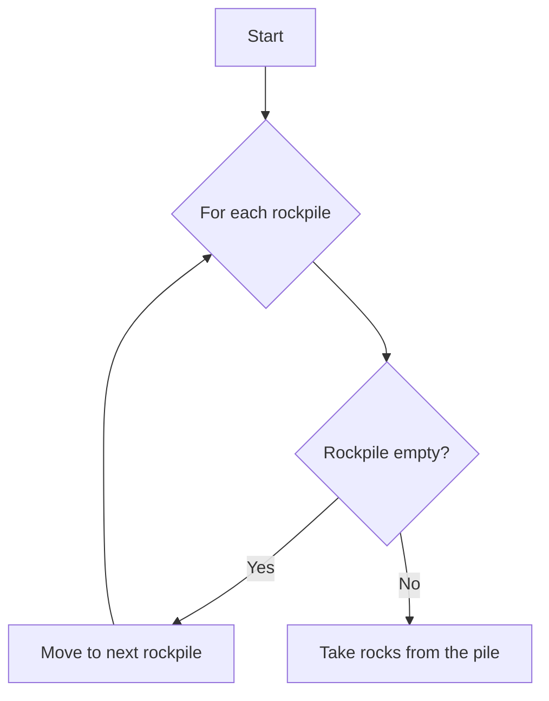

# Rock swap!

Thank you for coming out to Charlotte Hack rock swap competition!

**How to play?**
- There are several rock piles, with different amounts of rock in them.
- Player 1 will take as many rocks as they would like from a pile they choose
- Player 2 follows
- The player who takes the last rock from all of the piles win!

**Lets think about this programmatically?**
What constraints would exist?
- We can't take more rocks in a pile than rocks in a pile
- We can't take from multiple piles
- A player can't add rocks to the pile (take negative rocks)
- A player can't go for multiple turns in a row

What is the win condition?
- When are no more rocks to take

 What kind of data type could we use to represent this game?
 - Lets use a list of integers

## Setup
Clone the git repo in a working directory:
`git clone https://github.com/ThatE10/rock-battle.git`

Run player_main.py to play against a bot_1

Run main.py to see two bots battle!

## Creating your own bot:
First think of a strategy in how you could possible win by playing against yourself or others and note any observations.  
- Take the rocks from the first non empty pile

Second create a really cool name for your bot like 
- `DESTROYER`

Third create a flow chart for how your bot might work



Finally we want to turn this into code.  

```
name = "Ethan"
bot_name = "DESTROYER!"

def bot(board,turn = 0) -> (int, int):
    """
    Determines the bot's move based on the current board state.

    Args:
        board (list): A list representing the number of rocks in each rockpile.

    Returns:
        tuple: A tuple (index, rockpile_amount) representing the number of rocks to remove and the index of the rockpile.
    """
    
    for index, rockpile_amount in enumerate(board):
        # If the rockpile is not empty, return the number of rocks in the rockpile and its index
        if rockpile_amount != 0:
            
            return index, rockpile_amount
```
## Competition
Once you have completed your bot please submit here: [Form](https://forms.gle/CnAZZgQFoEinmX716)

At the end of the session we will battle all of the bots against each other, *if your bot throws an error or invalid move you will be eliminated.*

During a round of two bots, both will be given a chance to go first. 
The winner will receive a score of **1/(number of turns)**
